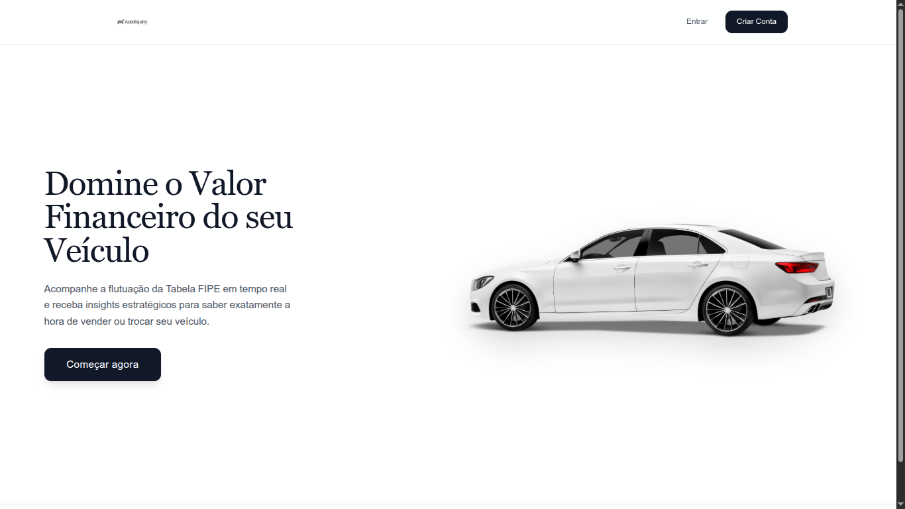
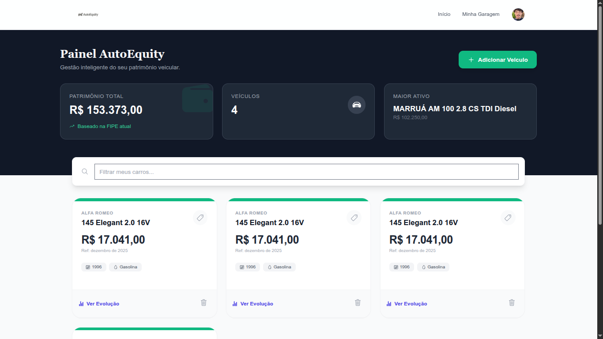
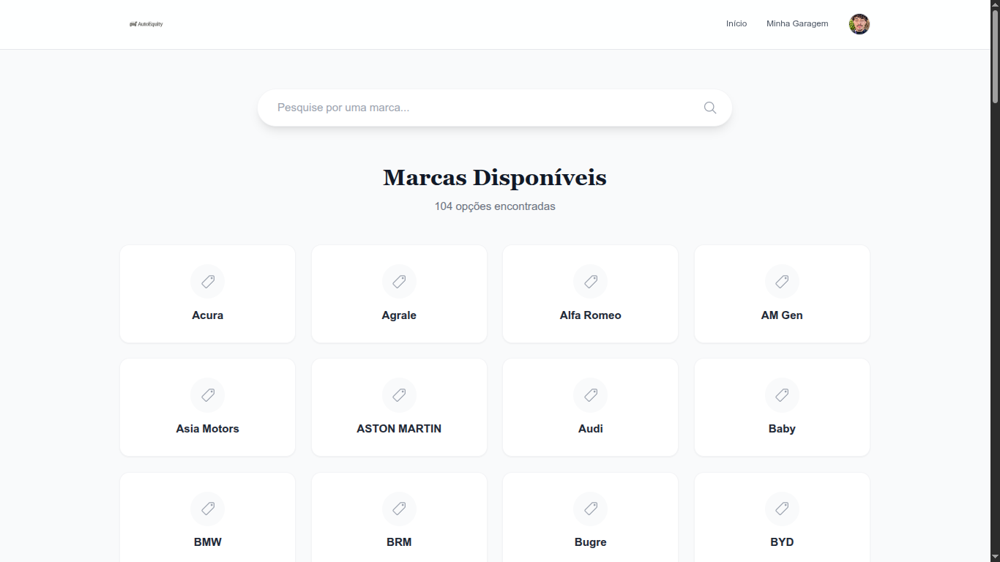
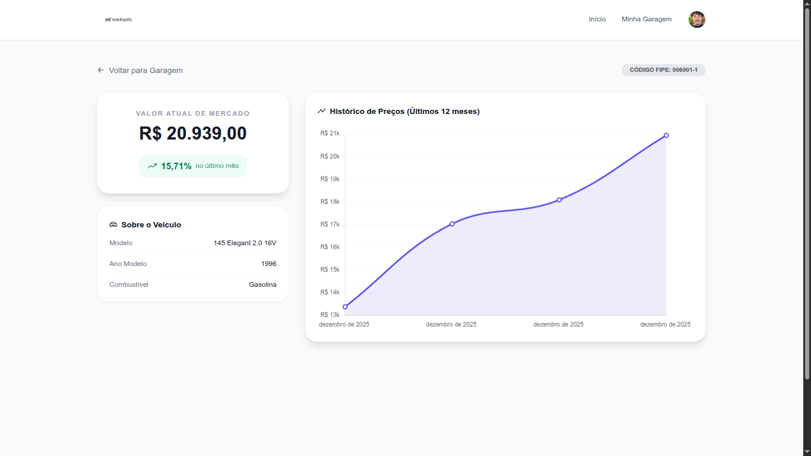
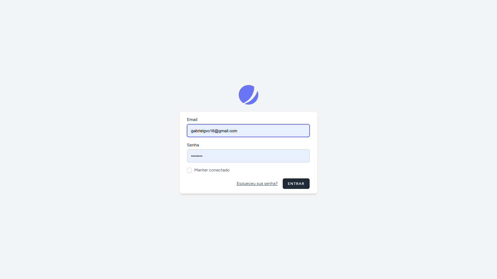
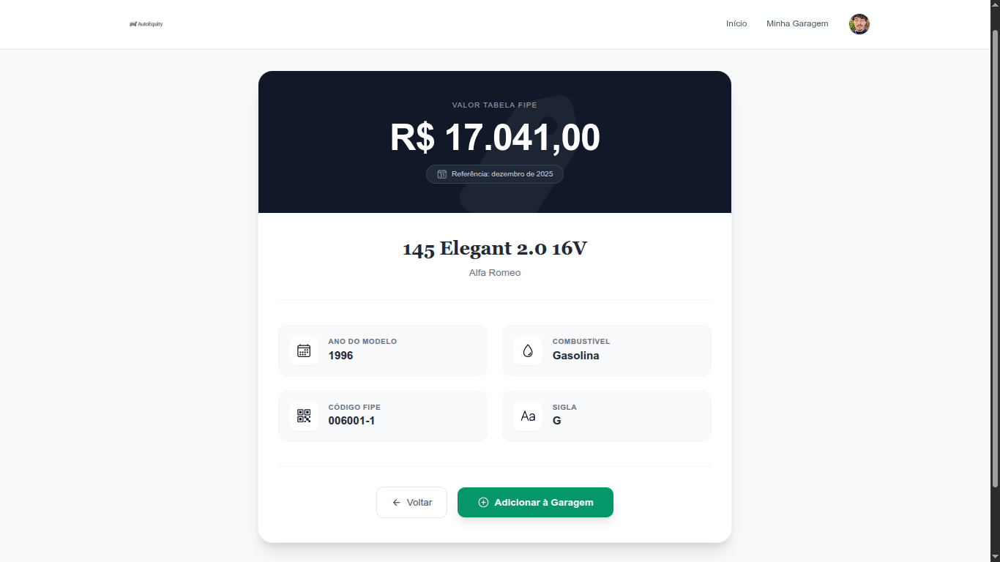

#  AutoEquity


> **Domine o valor financeiro do seu veículo.**

O **AutoEquity** é uma plataforma Fullstack desenvolvida para proprietários de veículos que desejam monitorar a valorização ou depreciação do seu patrimônio automotivo. A aplicação consome dados em tempo real da Tabela FIPE e gera análises gráficas de histórico de preços.

 **[Acesse o Projeto Online (Demo)](https://SEU-LINK-DO-RENDER-AQUI.onrender.com)**

---

## Funcionalidades Principais

-   ** Monitoramento em Tempo Real:** Consulta atualizada de preços via API da Tabela FIPE.
-   ** Minha Garagem (CRUD):** Gestão completa de veículos (Adicionar, Visualizar, Excluir) vinculada ao usuário logado.
-   ** Dashboard Financeiro:** Cálculo automático do patrimônio total do usuário e identificação do ativo mais valioso.
-   ** Análise de Mercado:** Gráficos interativos com histórico de preços dos últimos 12 meses e cálculo de % de valorização.
-   ** Busca Inteligente:** Filtro em tempo real (JavaScript puro) para localizar marcas, modelos e anos instantaneamente.
-   ** Sistema de Login:** Autenticação completa, perfil de usuário e upload de foto (Laravel Jetstream).

---

## Screenshots

| Visão Geral | Área do Usuário |
|:---:|:---:|
| **Welcome Page**<br> | **Dashboard Financeiro**<br> |
| **Home (Marcas)**<br> | **Análise Gráfica**<br> |
| **Login**<br> | **Minha Garagem**<br> |

---

##  Tecnologias Utilizadas

### Backend
-   **PHP 8.3**
-   **Laravel 11**
-   **MySQL**
-   **HTTP Client** (Consumo de APIs)

### Frontend
-   **Blade Templates**
-   **Tailwind CSS**
-   **Chart.js** (Gráficos)
-   **Ionicons**
-   **JavaScript Vanilla**
-   **Livewire** (Componentes dinâmicos)

### Infraestrutura & Deploy
-   **Docker** (Containerização)
-   **Render.com** (Hospedagem)
-   **TiDB Cloud** (Banco de Dados Serverless)

---

## APIs Integradas

1.  **Parallelum API:** Utilizada para a navegação hierárquica (Marcas → Modelos → Anos).
2.  **BrasilAPI:** Utilizada para buscar o histórico profundo de preços para os gráficos.

---

##  Como rodar localmente

Pré-requisitos: PHP 8.3, Composer e Node.js.

```bash
# 1. Clone o repositório
git clone [https://github.com/SEU-USUARIO/autoequity.git](https://github.com/SEU-USUARIO/autoequity.git)

# 2. Entre na pasta
cd autoequity

# 3. Instale as dependências do PHP
composer install

# 4. Instale as dependências do Frontend
npm install
npm run build

# 5. Configure o .env
cp .env.example .env
# (Configure seu banco de dados no arquivo .env)

# 6. Gere a chave da aplicação
php artisan key:generate

# 7. Rode as migrations
php artisan migrate

# 8. Crie o link simbólico para imagens
php artisan storage:link

# 9. Inicie o servidor
php artisan serve
```

## Licença

Este projeto está sob a licença **MIT**.  
Veja o arquivo [LICENSE](LICENSE) para mais detalhes.

---

##  Autor

Desenvolvido por **Gabriel Vinícius de Oliveira**.
